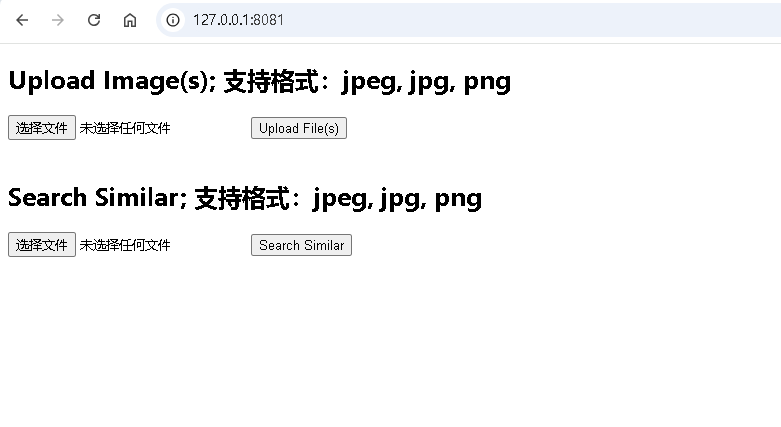
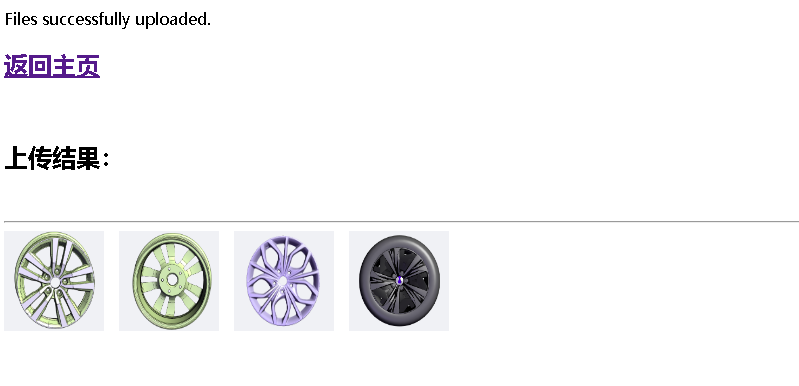
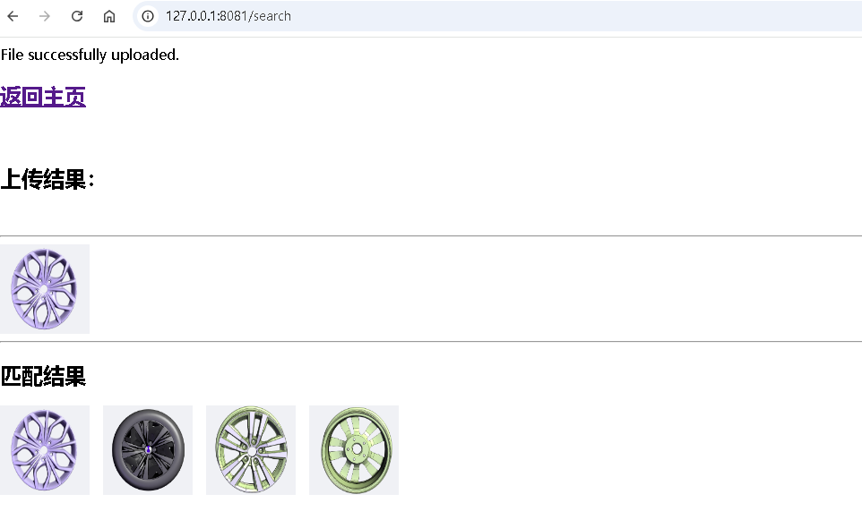

# 以图搜图

**运行环境**

* OS 版本: `Windows 11`
* Python 版本: `Python 3.10.15`

**运行依赖**

* inception_v3 or resnet101 模型
* [milvus](https://milvus.io/)

## 运行 Demo

```shell

## 下载脚本
#curl -o install_milvus/standalone_embed.sh https://raw.githubusercontent.com/milvus-io/milvus/master/scripts/standalone_embed.sh 

## 运行 milvus
# ./install_milvus/standalone_embed.sh start
docker pull milvusdb/milvus:v2.4.13-hotfix
docker network create --driver=bridge my-network
docker-compose -f install_milvus/docker-compose.yaml up -d

## 开发安装环境
pip install -r requirements.txt -i https://mirrors.aliyun.com/pypi/simple
# or
pip install pymilvus==2.4.8 -i https://mirrors.aliyun.com/pypi/simple
pip install tensorflow-cpu==2.17.0 -i https://mirrors.aliyun.com/pypi/simple
pip install pillow==11.0.0 -i https://mirrors.aliyun.com/pypi/simple
pip install flask==3.0.3 -i https://mirrors.aliyun.com/pypi/simple

## 运行服务
python .\src\main.py

## 浏览器打开 127.0.0.1:8081
```

## 测试验证

浏览器打开网址 [http://127.0.0.1:8081](http://127.0.0.1:8081)

**dashboard**

**upload_and_extract_feature**

**upload_and_search_similar**


## Give a star! ⭐

* 如果您觉得这个项目有趣，或者对您有帮助，请给个star吧！
* If you think this project is interesting, or helpful to you, please give a star!